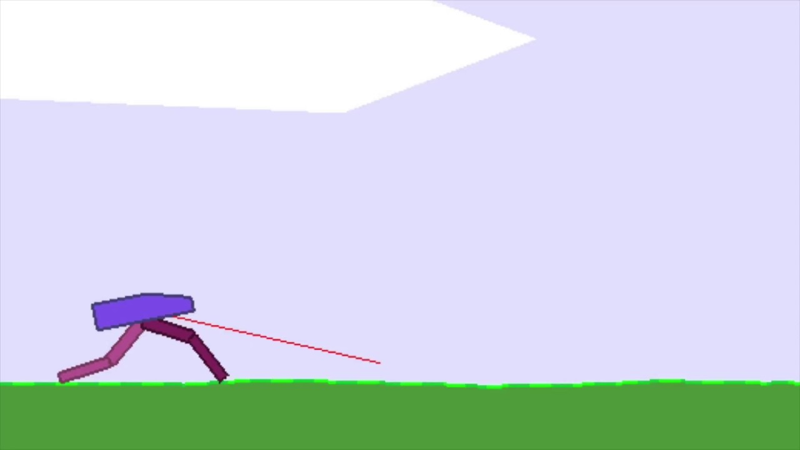

# Deep Reinforcment Learning - Assignment (2023)

This repository contains our code for the RUG's Deep Reinforcement Learning course, as part of the MSc Artificial Intelligence degree.

It is divided into two parts:
1. A Deep Q-Network (DQN) is trained on the game of Catch (similar to the game of Pong)
2. A Proximal Policy Optimisation (PPO) model is trained on Gymnasium's BipedalWalker-v3 environment.


The combination of deep neural networks and reinforcement learning algorithms has brought about a paradigm shift in the field of artificial intelligence, enabling autonomous learning and decision-making in complex environments. In this report, two influential DRL algorithms, Deep Q-Networks (DQN) and Proximal Policy Optimization (PPO), are studied. DQN is applied to the Catch environment, where an agent catches falling objects, while PPO is applied to the BipedalWalker-v3 environment, involving a two-legged robot navigating uneven terrain. Results show DQN achieves convergence in around 2000 training episodes with an average reward of 0.791 and near-perfect ultimate performance. Our trained PPO models consistently collect around 300 points per episode, learning to solve the environment in 2.5 to 3 million timesteps. The trained agents demonstrate various walking behaviours, successfully completing the environment.


## Instructions

<details>
<summary>Installation</summary>
<br>

We use a conda environment, which is in the Part2 folder. It can be activated by the command:

   ```conda env create -f gymEnv.yml ```

The installation of ``gymnasium`` and ``box2d`` for Task3 can be tricky, the ``requirements.txt`` file may also help here. The ``stable-baselines3`` library is used to import the PPO architecture. For part 1, the DQN model is implemented from scratch, using the ``pytorch`` library.

</details>


### Part 1: DQN
The final DQN models are trained using the command
    ```python Final_Model.py```
which will train 5 DQN models on the Catch environment, a screenshot of which is seen below. A gridsearch was conducted to arrive at the final DQN hyperparamters and model architecutre.


### Part 2: PPO

The PPO model, with optimised parameters, can be trained by using the command
    ```python trainOptimised.py```
which will train a PPO model for 5e6 timesteps on 16 (independent) environments in parallel. The BidedalWalker-v3 environment consists of a body with 2 legs, and 4 total joints upon which to apply torque, as shown below.




Gridsearch of the hyperparameters was conducted using the ```gridsearch.py``` script (in the Part2 folder), the results of which were saved into excel spreadsheets and evaluated using the relevant jupyter notebook files in the Part2 folder.


## Results